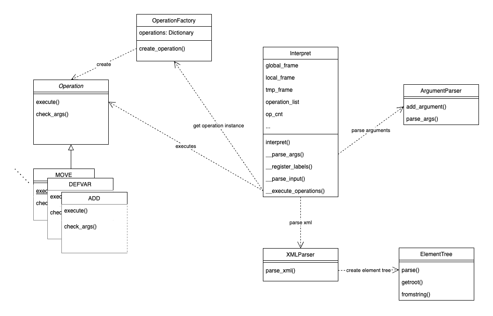

Implementační dokumentace k 2. úloze do IPP 2022/2023  
Jméno a příjmení: `Lukáš Večerka`  
Login: `xvecer30`
# IPP Projekt 2
## Struktura
- `interpret.py` - vstupní bod pro spuštění interpretace
- `lib`
  - `interpret_class.py` - obsahuje třídu `Interpret`, která zajištujě celý chod interpretace a `XMLParser`, která implementuje parsování vstupního XML kódu do instrukcí, obsahuje implementaci meta třídy `Singleton`
  - `op_factory.py` - obsahuje třídu `OperationFactory`, která má za úkol vytváření instancí operací
  - `operations.py` - obsahuje abstraktní třídu `Operation`, a třídy pro jednotlivé operace
  - `utils.py` - obsahuje pomocné funkce, které jsou používány v různých částech interpreteru
### UML

## Implementace
### Třída Interpret
 - jedináček obsahující metodu `intepret()`, která je volána ze vstupního bodu `interpret.py`
 - metoda nejdříve zkontroluje argumenty příkazové řádky, a uloží si cesty k souborům
 - následně načte zdrojový kód buď ze souboru a nebo ze standardního vstupu, který dále pomocí knihovny `xml.etree.ElementTree` zpracuje, zkontroluje jestli je XML kód ve správném formátu a následně ho uloží do seznamu instrukcí který je seřazen podle atributu `order`
 - po načtení XML kódu se staticky zkontroluje, jestli program neobsahuje definice návěští, které se uloží do slovníku návěští, který obsahuje číslo instrukce, tím je zajištěno že pri spuštění programu se může provést skok dopředu
 - poté se ve smyčce, která je ukončena při překročení počtu instrukcí, postupně prochází seznam instrukcí, kde se při každé iteraci vytvoří pomocí továrny instance operace, a zavolá se nejdříve její metoda `check_args()`, a následně `execute()` 
 - v případě že se vyskytne chyba, je vypsána chybová hláška a program se ukončí dle specifikovaného návratového kódu
### Operace
 - každá operace je potomkem abstraktní třídy `Operation`, která obsahuje metody `check_args()` a `execute()`, které jsou implementovány konkrétními operacemi
 - metoda `check_args()` zkontroluje, jestli operace obsahuje správný počet operandů, a jestli jsou tyto operandy ve správném formátu
 - metoda `execute()` provede sémantické kontroly a v případě že je vše v pořádku, provede sémantické kroky dané operace a po dokončení nastaví čítač operací na novou hodnotu
 - operace jsou vytvářeny pomocí továrny `OperationFactory`, která obsahuje slovník operací a podle názvu operace vrací instanci dané operace, tím je využit polymorfismus, protože se ve smyčce provádění operací volá pouze metoda `execute` dané instance, kód je pak přehledný a při přidávání nových operací stačí přidat jen implementaci nové operace a přidat ji do továrny
### Paměťový model a řízení toku
- v rámcích jsou proměnné ukládány jako slovník typu `{'type': 'typ', 'value': 'hodnota'}`
- třída `Interpret` pro řízení toku a paměťový model používá následující proměnné
    - `self.global_frame` - slovník, pro ukládání proměnných v globálním rámci
    - `self.local_frame` - seznam slovníků, pro ukládání proměnných v lokálním rámci, se seznamem se pracuje jako se zásobníkem (pracuje se vždy s rámcem, který je na vrcholu)
    - `self.tmp_frame` - slovník, pro ukládání proměnných v dočasném rámci, má hodnotu `None` dokud není zavolána operace `CREATEFRAME`, při operaci `PUSHFRAME` se do zásobníku `local_frame` přidá `tmp_frame` a `tmp_frame` se nastaví na `None`
    - `self.label_dict` - slovník návěští, kde hodnota klíče je číslo instrukce, na které se má skočit
    - `self.stack` - datový zásobník, pro ukládání hodnot
    - `self.call_stack` - zásobník pro volání funkcí, při volání funkce pomocí `CALL` se do zásobníku přidá číslo instrukce, na které se má po skončení funkce vrátit při použití `RETURN`
    - `self.operation_list` - seznam instrukcí, které se mají provést, operaci jsou uloženy jako slovník typu `{'opcode': 'název operace', 'arg1': {...}, ...}`
    - `self.op_cnt` - čítač operací, který se po provedení instrukce nastaví na novou hodnotu
    - `self.input_lines` - seznam řádků ze standardního vstupu, které se používají při operaci `READ`, pokud není argument `--input` specifikován, používá se funkce `input()`
    - `self.input_line` - čítač řádků ze standardního vstupu, který se po použití `READ` zvýší o 1